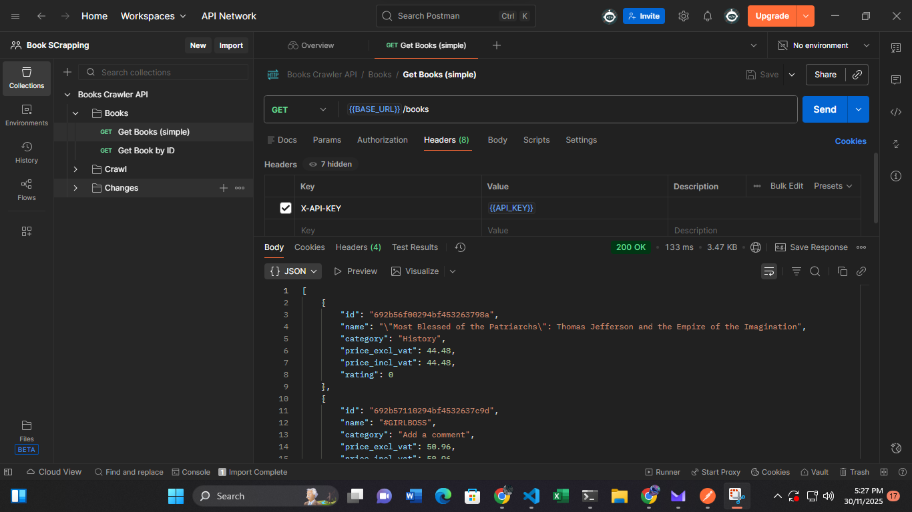
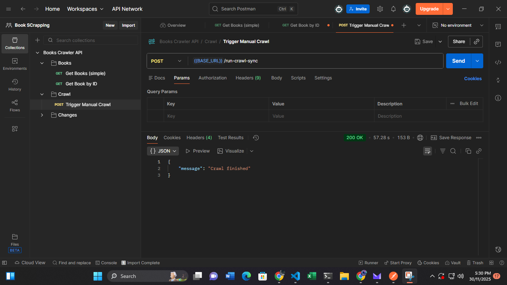

# 📚 **Books Web Crawler, Change Detector & REST API**

A fully asynchronous web-crawling system built with **httpx**, **FastAPI**, **Motor (MongoDB)**, and **APScheduler**.
The system crawls product data from **[https://books.toscrape.com](https://books.toscrape.com)**, detects changes (e.g., price updates), stores snapshots, and exposes a secure REST API with filtering, pagination, and rate-limiting.

---

## 🚀 Features

### **Crawler**

* Fully **async** (`httpx` + `asyncio`)
* Pagination support
* Extracts:

  * Book title
  * Description
  * Category
  * Prices (incl/excl tax)
  * Availability
  * Review count
  * Rating
  * Cover image URL
* Stores:

  * Metadata
  * Raw HTML snapshot
  * Content hash for change detection
* Robust retry logic
* Resume-safe (Idempotent insert/update)

### **Change Detection**

* Daily automated crawl
* Content-hash comparison (`SHA256`)
* Detects:

  * New books
  * Price changes
  * Availability changes
* Logs changes in a separate collection
* Supports daily change reports (JSON/CSV)

### **REST API (FastAPI)**

* `/books` → filtering, sorting, pagination
* `/books/{id}` → full book details
* `/changes` → recent changes
* `/run-crawl` → manual crawl trigger
* API key authentication (`X-API-KEY`)
* Rate limiting (100 req/hour/user)
* Auto-generated documentation via Swagger/OpenAPI

### **Tech Stack**

| Component     | Technology                   |
| ------------- | ---------------------------- |
| Web Framework | FastAPI                      |
| Crawler       | httpx + asyncio + Selectolax |
| Database      | MongoDB (Motor async client) |
| Scheduler     | APScheduler                  |
| Auth          | API key-based                |
| Rate Limiting | In-memory (dev)              |
| Testing       | Pytest + mongomock_motor     |
| Deployment    | Uvicorn / Docker             |

---

# 📁 Project Structure

```
project/
├── api/
│   ├── main.py
│   ├── routes.py
│   ├── auth.py
│   
├── crawler/
│   ├── client.py
│   ├── crawl_manager.py
│   ├── parser.py
│   └── models.py
├── db/
│   ├── mongo.py
│   
├── scheduler/
│   └── jobs.py
├── utils/
│   ├── config.py
│   ├── hashing.py
│   └── logger.py
├── tests/
│   ├── test_models.py
│   └── test_mongo.py
├── requirements.txt
├── .env.example
└── README.md
```

---

# 🔧 Installation & Setup

## 1️⃣ Clone the repository

```bash
git clone https://github.com/your-username/books-crawler.git
cd books-crawler
```

## 2️⃣ Create a virtual environment (recommended)

```bash
python3 -m venv venv
source venv/bin/activate
```

## 3️⃣ Install dependencies

```bash
pip install -r requirements.txt
```

---

# 🗄️ Database Setup (MongoDB)

You need a running MongoDB instance.

### **Option A — Local MongoDB**

```bash
sudo systemctl start mongod
```

### **Option B — Docker**

```bash
docker run -d -p 27017:27017 --name mongo mongo:latest
```

---

# ⚙️ Environment Configuration

Create an **`.env`** file:

```bash
cp .env.example .env
```

### `.env.example`

```env
MONGO_URI=mongodb://localhost:27017
MONGO_DB=booksdb
API_KEYS=["devkey123"]
RATE_LIMIT_PER_HOUR=100
CRAWL_CONCURRENCY=10
CRAWL_RETRY=3
BASE_URL=https://books.toscrape.com
SCHEDULER_ENABLED=true
```

---

# ▶️ Running the Application

## **Start the API server**

```bash
uvicorn api.main:app --host 0.0.0.0 --port 8000 --reload
```

### Swagger UI:

👉 [http://localhost:8000/docs](http://localhost:8000/docs)
(Use `X-API-KEY: devkey123` in the top-right authentication box.)

---

# 🕒 Running the Scheduler (Automatic Daily Crawl)

The scheduler runs **every day at 00:30** automatically.
It's enabled via:

```env
SCHEDULER_ENABLED=true
```

If you want to disable auto-crawling (for dev):

```env
SCHEDULER_ENABLED=false
```

---

# ▶️ Manual Crawl Trigger (Development Helper)

You can manually start a crawl using:

### **POST /run-crawl**

```bash
curl -X POST http://localhost:8000/run-crawl \
  -H "X-API-KEY: devkey123"
```

Response:

```json
{ "message": "Crawl started" }
```

---

# 🔍 API Usage Examples

### **GET /books**

```bash
curl "http://localhost:8000/books?category=Poetry&min_price=10" \
  -H "X-API-KEY: devkey123"
```

### **GET /books/{id}**

```bash
curl http://localhost:8000/books/6778802cb50b22092c56bb06 \
  -H "X-API-KEY: devkey123"
```

### **GET /changes**

```bash
curl http://localhost:8000/changes \
  -H "X-API-KEY: devkey123"
```

---

# 🧪 Running Tests

All tests run fully offline:

```bash
pytest -q
```

Tests include:

* Pydantic model validation
* MongoDB layer using `mongomock_motor`
* Index creation
* Insert/find behavior

---

# 🧱 Database Example Document

### **Book Document**

```json
{
  "name": "A Light in the Attic",
  "category": "Poetry",
  "price_excl_vat": 45.17,
  "price_incl_vat": 50.00,
  "availability": "In stock",
  "rating": 3,
  "source_url": "https://books.toscrape.com/...",
  "crawl_timestamp": "2025-11-29T10:00:00Z",
  "content_hash": "5a2f...",
  "raw_html": "<html>...</html>",
  "status": "ok"
}
```

### **Change Log Document**

```json
{
  "book_id": "6778802cb50b22092c56bb06",
  "source_url": "https://books.toscrape.com/...",
  "change_type": "updated",
  "when": "2025-11-29T10:05:00Z",
  "details": {
    "price_excl_vat": { "old": 45.17, "new": 43.00 }
  }
}
```

---

# 🐳 Docker Setup (Optional)

## docker-compose.yml (example)

```yaml
version: "3.8"
services:
  api:
    build: .
    ports:
      - "8000:8000"
    env_file:
      - .env
    depends_on:
      - mongo
  mongo:
    image: mongo
    container_name: mongo
    restart: always
    ports:
      - "27017:27017"
```

---

# 🚀 Deployment Tips

* Run via **Uvicorn workers** behind Nginx
* Add Redis-based rate limiting for multi-instance deployments
* Move API keys to environment secrets
* Use MongoDB Atlas for scaling
* Containerize with Docker for production


# 📄 License

MIT License.

# Screenshots

### GET BOOKS


### GET BOOK BY ID


### TRIGGER CRAWL


### CHANGES

